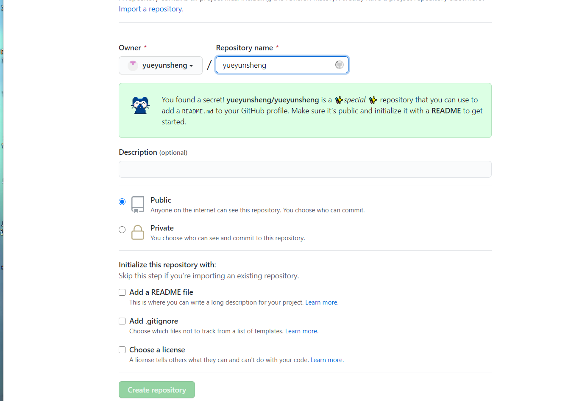
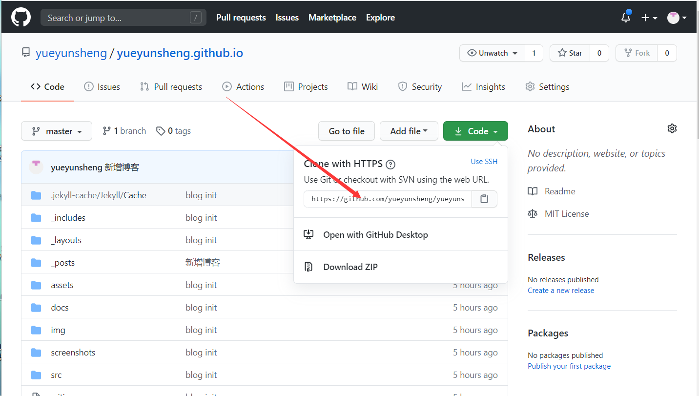

### 1.在GitHub上注册用户并建立一个以username.github.io 的仓库


### 2.安装git，然后打开Git Bash，拉取刚刚创建的项目


```
git clone https://github.com/yueyunsheng/yueyunsheng.github.io.git
```
### 3.选择一个主题，在此选择jekyll-theme-persephone
  其他主题可以到 *http://jekyllthemes.org*寻找合适的主题。
下载主题后解压到刚刚git clone的项目的目录下。
### 4.安装Ruby。百度Ruby安装教程。
### 5.安装Jekyll

```
gem install jekyll
```
### 6.进入刚刚的git clone的仓库目录下执行
```
bundle install
```
安装bundle
### 7.启动Jekyll服务
```
bundle exec jekyll serve
```
*如果没有启动报错的话，在浏览器输入127.0.0.1:40000 则能访问到页面了*
一般报错是由于配置的原因
启动不了很有可能是Gemfile引入插件错误或者不存在导致的，需要先要gem install ，然后在Gemfile引入才生效。
页面加载错误多是_config.yml配置有问题。注意仓库名要是*username*.github.io

